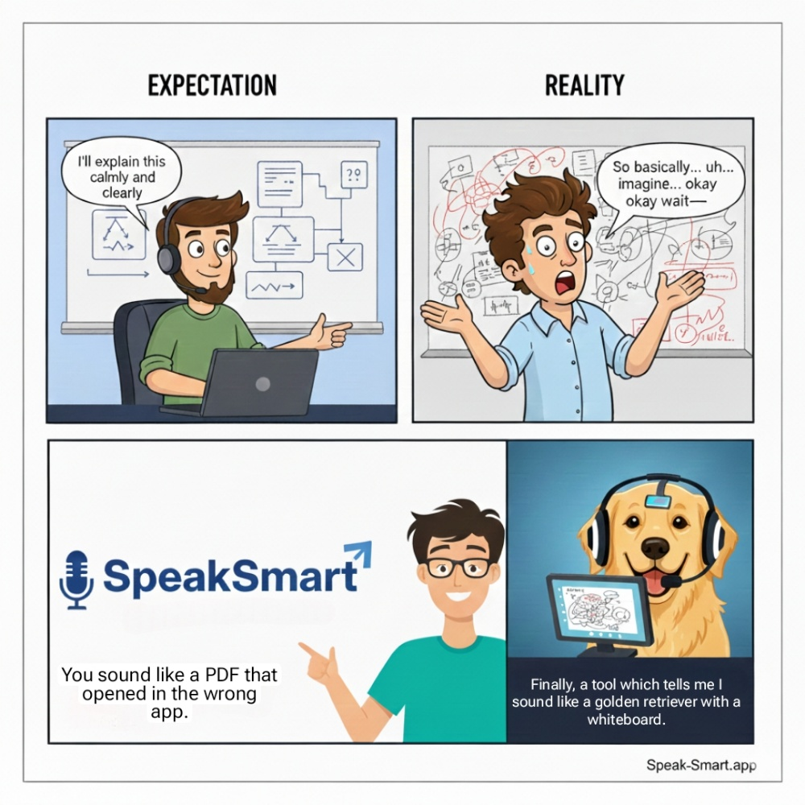
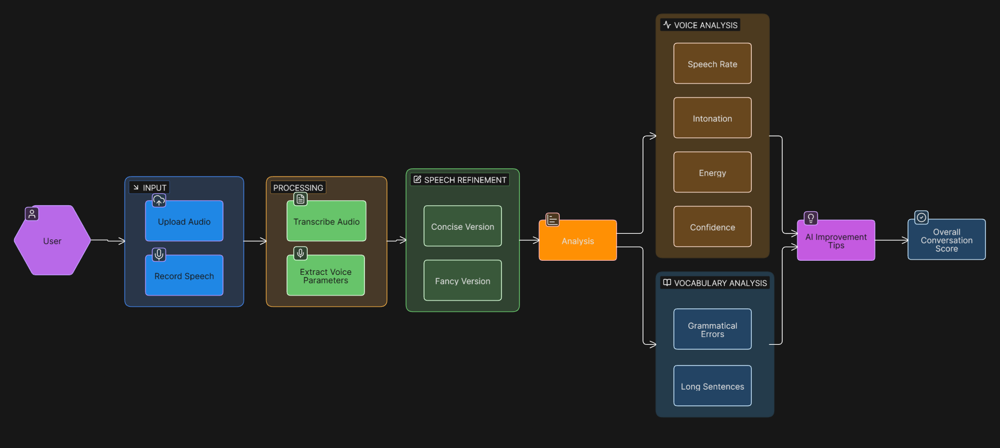

### What is [SpeakSmart](https://www.speak-smart.app/)?
It is a speech training platform that helps you improve your speaking skills.

### Evolution of SpeakSmart
- [**Init**](https://github.com/tranquility404/speak-smart-backend): Participated in my 1st hackathon and won 1st prize. Crazzzy! I couldn't even believe it. I built backend using `python`, `FastApi`, used `open-ai whisper` model for stt, `Llama-3.3` for vocab analysis, librosa to extract voice parameters. But I wasn't able to deploy it as it was occupying too much memory and no deployment service's free tier allowed me to deploy it free of cost😭
- **Major Update 1:** So, I thought SpringBoot is pretty neet. Let's split it into 2 services:
  - 1). spring boot backend
  - 2). fastapi backend for llm api calls and voice params extraction
- **Major Update 2:** After completing that, I realized, even though I learned `microservices` like this but it still is an overkill for simple voice params extraction and llm api calls. I can just write native code if java doesn't have inbuilt support for those llms and find a java based alternative for librosa. So, I converted it into a [`Monolith service`](https://github.com/tranquility404/speak-smart). Wrote **AIController**. Found TarsosDsp an alternative of librosa.
- **Major Update 3 (Current):** But as features started to grow, I found my code starting to get messy. So, I decided to convert it into a `multi-module` project following `separation-of-concerns` principle with `Hexagonal Architecture`: Ports & Adapters. Also learn `Kafka` and implement `Event-driven Architecture` so I don't have to trigger everything myself. I could just trigger an event: **ANALYSIS-COMPLETED** and the consumer will catch it and trigger stats calculation, points update and other stuff.
### Why use SpeakSmart?

### How it works?

### Wanna know more?
> Get in touch at [work.with.aman.verma@gmail.com](mailto:work.with.aman.verma@gmail.com)
